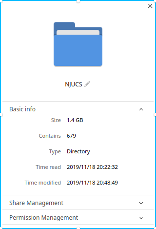
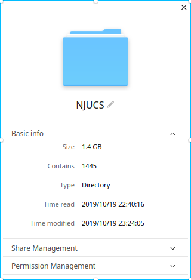
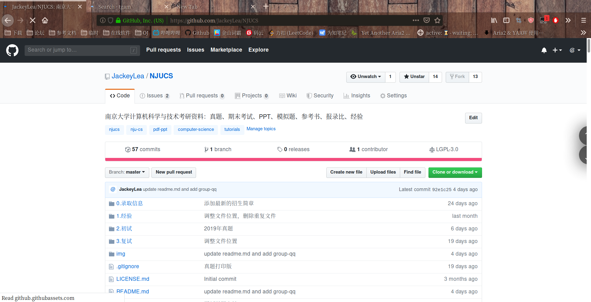
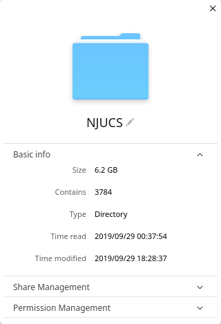
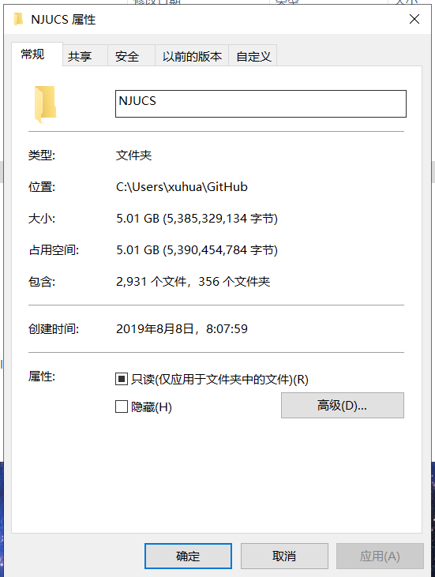
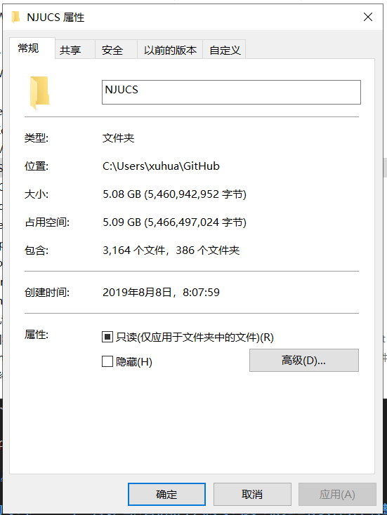
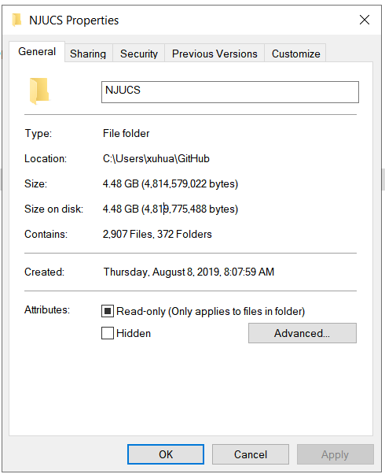

# 更新说明

2019-11-18：

添加复试资料；

添加思维导图；

2019-11-14:

添加视频教程地址

2019-10-20:

添加数据结构资料；

2019-10-19:

重置项目文件，删除以前版本的文件；

文件内容减少至3G左右；

正好乘此机会进行文件调整；

这样看起来就可以接受了。

精简之前

精简之后

添加408真题和参考答案；

添加845真题和参考答案；

添加初试经验；

添加专业课模拟题；

添加计算机网络自顶向下资料；

添加操作系统教程资料；

添加计算机系统基础资料；

2019-10-13:

添加2019年真题图片；

添加模拟题；

2019-9-29:

添加无水印版408真题；

添加部分初试资料；

添加考点标记；

这是git文件夹的大小

可以看出实际上只有3G左右，还是有点大，这是由于前期的文件结构问题造成的。

主要是用于恢复之前版本的文件。

2019-9-28：

删除部分重复文件；

添加408系列真题；

将部分文件转换为pptx文件；

2019-9-25：

更新说明文档；

添加招生简章；

添加资料；

2019-9-18：

更新说明文档；

删除重复的文件；

2019-9-13：

添加GitHub lfs功能，以支持大文件PDF；

合并参考书目文件夹至初试中；

添加参考书目、参考书的习题答案、参考书配套PPT；

2019-8-29：

删除重复的录取信息文件；

2019-8-26：

更新说明文档；

2019-8-9：

添加真题PDF文件；

添加考研经验；

添加录取信息资料；

添加复试真题；

添加初试专业课资料；

2019-8-8：

添加南京大学介绍、联系方式、安排表等；

2019-8-5：

创建项目；